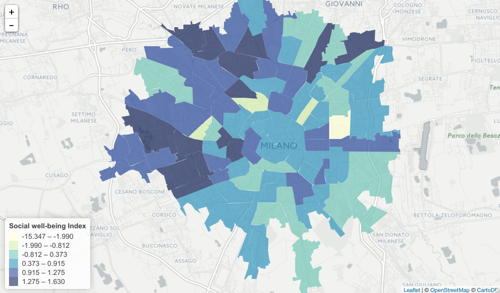

The goal of CrowdSensing Census project in DSSG 2016 is to develop a reliable and general model that can complement census data by making use of other real-time data such as OpenStreetMap data or Cellphone Detail Records (CDR) to determine the social economic conditions in a particular region. This work is meaningful for allowing data freshness and cost efficiency compared to census data, since government-initiated socio-economic statistics are expensive and often outdated (10-year term). 

Specifically, a prediction model would be developed from available datasets targeting the city of Milano and the province of Trento, Italy. We target these cities as the Big Data Challenge initiative made it possible to open Telecom Italia data (CDR) to the public <a href="http://www.nature.com/articles/sdata201555" target="_blank">(Barlacchi, et al., 2015)</a>. For the ground truths, we are trying to make use of the census data that include, but are not limited to, the statistics about illiteracy, school degree, foreigners, rented dwelling, unemployment and work force. We first conducted Principle Component Analysis (PCA) for the non-monetary variables about citizen well-beings. The PCA was used to see whether the variables represent a single dimension of socio-economic status.

 

Currently, the first component of the PCA result represents only about 40% of the variables, so it may not be a strong indicator of a single measure for the socio-economic level. Despite the weakness, we tried to use the measure to see the relationship with the CDR data (i.e., aggregated call-in, call-out, sms-in, sms-out, and internet usage) for the data exploration. As expected, the regressions showed that there were no significant relationships between cellphone activities and quasi (?) socio-economic levels. This was expected result, because cellphone activities vary a lot depending on time and day. To further the analyses, we have extracted time- and day-specific cellphone activity values and will conduct more granular analyses this week. 

The biggest challenge that we face now is data availability. The available census data are not enough to determine the level of poverty because it lacks the most important variable – the income data. Official socio-economic measures/constructs include the United Nations (UN)’s Multidimensional Poverty Index (MPI) that consists of ten variables such as education, health and living standard and the World Bank’s income data and consumption expenditure. Since both the income and several health/living standard variables are not available from the open government websites, we are actively working on finding data sources that can be used for the ground truth of the study. 
Even though we are struggling from data availability, we have learned many useful techniques and tools for the last two weeks as exploring the data. Due to the large size of the datasets, we first learned how to increase computation efficiency for analyzing the data. For example, using Pandas library in Python was very effective in conducting matrix-based calculations. In a similar way, R provides dplyr package for dealing with a large file. Lately, we found that some CDR datasets too big to fit into local machine storage. This led us to explore Spark running on an AWS instance, which allows us to use MapReduce framework, a cloud-based parallel computing for a big data, using Python interfaces. As our data-management skills improve with various tools, we hope to provide meaningful insights/results in the near future. 
